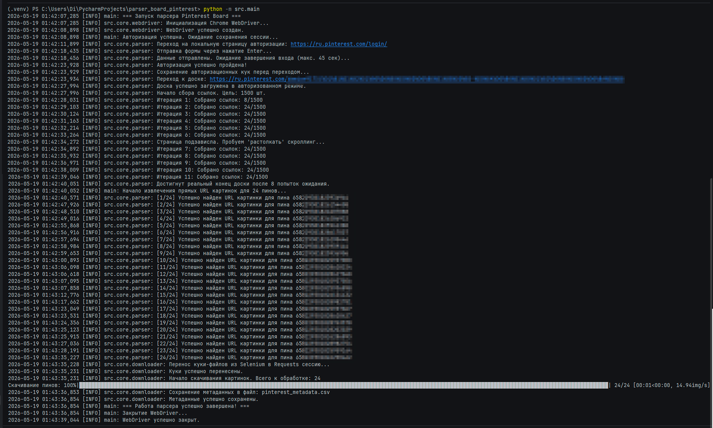
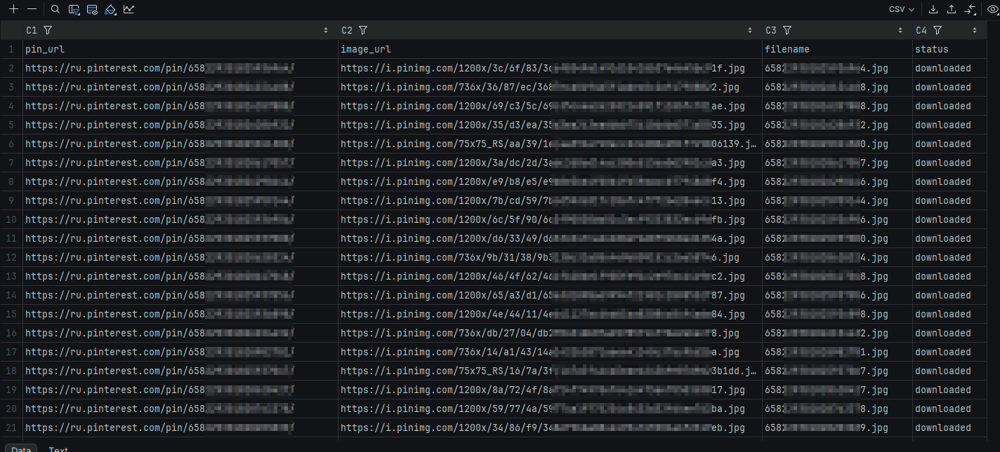

# Pinterest Board Image Downloader (AQA / Python Portfolio Project)


Скрипт логинится на пинтересте, притворяется пользователем (обход Anti-Bot) и скачивает в /downloads все оригинальные изображения с доски в максимальном разрешении

## Ключевые архитектурные и технические фичи

В проекте применены распространенные практики проектирования и подходы к построению устойчивой UI-автоматизации:
* **SOLID & Clean Architecture**: Код полностью декомпозирован на модули с разделением обязанностей (конфигурация, доменная модель данных, фабрика драйвера, бизнес-логика парсинга и утилита загрузки).
* **Смешанный подход (Selenium + Requests)**: Авторизация и сбор ссылок выполняются в веб-драйвере, после чего сессионные куки инжектируются в `requests.Session`. Это позволяет скачивать тысячи файлов на максимальной скорости I/O без накладных расходов браузера.
* **Anti-Bot Bypass & Smart Selectors**: 
  * Эмуляция поведения человека (посимвольный ввод, «шум» в задержках времени, микро-скроллинг).
  * Использование стабильного семантического атрибута `elementtiming="closeup-image-main-MainPinImage"` вместо хрупких динамических CSS-классов.
* **Умный скроллинг**: Логика сбора ссылок устойчива к «ленивой загрузке» (Lazy Loading) контента — скрипт дополнительно инициирует re-render контента через микро-скроллинг при остановке lazy-loading механизма.
* **Качественные ресурсы**: Парсер автоматически парсит атрибут `srcset` для извлечения картинок в максимальном доступном разрешении (`1200x` или `originals`), игнорируя пережатые превью-миниатюры.
* **Безопасность (Security Best Practices)**: Чувствительные данные (логин, пароль) изолированы в переменные окружения (`.env`) и защищены от случайного попадания в публичный репозиторий через `.gitignore`.
* **Lightweight CSV Export**: Метаданные сохраняются через встроенный `csv.DictWriter`, что уменьшает количество зависимостей и keeps the project lightweight.

Дальнейшая загрузка изображений выполняется через `requests.Session` с переносом cookies из браузера, что радикально ускоряет массовое скачивание и снижает overhead WebDriver.

## Решены инженерные задачи:

### Ленивая загрузка и бесконечная прокрутка
Pinterest динамически подгружает контент при скроллинге, из-за чего обычный `scrollTo(bottom)` периодически переставал инициировать загрузку новых элементов.

Решение:
- микро-скроллы вверх/вниз,
- контроль прироста уникальных ссылок,
- лимит итераций,
- adaptive waiting strategy.

### Обнаружение стабильных элементов
Pinterest использует динамические CSS-классы, меняющиеся между сессиями.

Решение:
использование стабильных семантических HTML-атрибутов вместо autogenerated CSS selectors.

## Стек

* **Язык**: Python 3.11+
* **Браузерная автоматизация**: Selenium 4 (используется встроенный автоматический Selenium Manager)
* **Сетевые запросы**: Requests
* **Консольный UI**: TQDM (Progress Bar)
* **Управление конфигурацией**: Python-dotenv, Pathlib

## Структура проекта

```text
parser_board_pinterest/
├── .env                  # Локальные секреты и настройки (игнорируется Git)
├── .gitignore            # Правила исключения файлов
├── README.md             # Документация проекта
├── requirements.txt      # Зависимости проекта
├── parser.log
├── pinterest_metadata.csv
└── src/
    ├── main.py           # Точка входа (Оркестратор процесса)
    ├── config/
    │   └── settings.py   # Синглтон конфигурации и настройка логирования
    ├── core/
    │   ├── webdriver.py  # Фабрика инициализации Chrome WebDriver
    │   ├── parser.py     # Класс PinterestBoardParser (сбор и экстракция ссылок)
    │   └── downloader.py # Класс ImageDownloader (загрузка файлов и сохранение CSV)
    └── models/
        └── pin.py        # Строгая доменная модель данных (Dataclass PinMetadata)
```

## Запуск проекта

### 1. Клонирование репозитория и переход в папку
[](https://github.com/Damian-Zaharov/parser_board_pinterest)

```bash
git clone https://github.com/USERNAME/parser_board_pinterest.git
cd parser_board_pinterest
```

### 2. Настройка виртуального окружения и установка зависимостей
```bash
python -m venv .venv
source .venv/bin/activate  # Для Linux/MacOS
.venv\Scripts\activate     # Для Windows

pip install -r requirements.txt
```

### 3. Настройка конфигурации (`.env`)
Создайте файл `.env` в корневой директории проекта и заполните его по следующему шаблону:
```env
PINTEREST_EMAIL=***@***.com
PINTEREST_PASSWORD=***
BOARD_URL=https://pinterest.com/***
DEST_DIR=./downloads

# Настройки парсинга
EXPECTED_PINS=1500
HEADLESS=False
SCROLL_PAUSE=1.0
MAX_SCROLL_ITER=5000
TIMEOUT=20
```

### 4. Запуск
Запуск проекта осуществляется как модуль из корневой папки:
```bash
python -m src.main
```

## Результаты
После успешного завершения работы скрипта:
1. В директории, указанной в `DEST_DIR`, сохранятся все скачанные изображения в формате `.jpg`. Имена файлов соответствуют уникальным ID пинов.
2. В корне проекта сформируется структурированный файл отчета `pinterest_metadata.csv` со статусами обработки каждого элемента (успешно скачано, дубликат, ошибка извлечения и т.д.).
3. Логи выполнения сессии будут параллельно выводиться в консоль и дублироваться в файл `parser.log`.

## Скриншоты

### Сбор данных и скачивание картинок в консоли:


### Результат сохранения (Файлы и CSV-отчет):
 


## License
MIT_